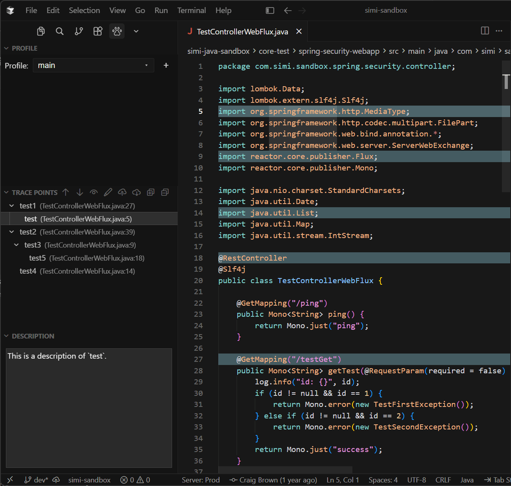
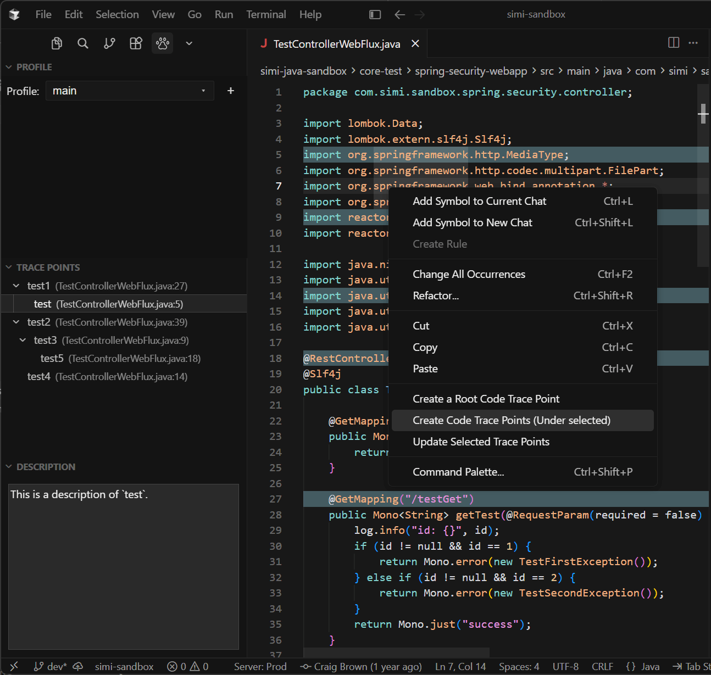

# Code Trace Tree
[](https://github.com/saidake/code-trace-tree-cursor/releases/latest)
[](./LICENSE)


----

<!-- Plugin description -->
<p>
  Trace code in a tree structure.
  Double-click any trace point to navigate to its source, with support for multiple trace levels.
</p>
<p>
  Includes a <b>Cursor-only</b> Agent Skill (bundled in this Cursor plugin) so Cursor Agent can
  search, add, move, and rebind traces, and refresh the Trace Points view when you ask.
  Cursor loads the skill automatically — you do not install it separately.
</p>
<!-- Plugin description end -->

# Preview



<!-- Plugin description -->
<h1>How to use</h1>
<ol>
  <li>Open the <b>Code Trace Tree</b> activity bar view.</li>
  <li>Use the <b>Profile</b> webview above the tree to switch trees, add a profile, or delete one.</li>
  <li>In the editor, right-click a line and choose:
    <ul>
      <li><b>Create a Root Code Trace Point</b> — start a new line-level trace tree</li>
      <li><b>Create Code Trace Points (Under selected)</b> — add a child under the selected node(s) in the tree</li>
      <li><b>Update Selected Trace Points</b> — move the selected tree node(s) to the current line</li>
      <li><b>Go to the Trace Point in the tree panel</b> — shown when the current line is a highlighted trace point; selects and reveals that node in the tree</li>
    </ul>
  </li>
  <li>In the <b>Explorer</b>, right-click a file or directory and choose:
    <ul>
      <li><b>Create a Root File/Directory Trace Point</b> — add a file or directory node at the root</li>
      <li><b>Create File/Directory Trace Point (Under selected)</b> — add that file/directory under the selected tree node(s)</li>
    </ul>
  </li>
  <li>Double-click a node in the tree to jump to that location (line, file, or Explorer for directories).</li>
  <li>Right-click a node and choose <b>Copy Trace Point Text</b> to copy its display text, e.g. <code>test233 (TestControllerWebFlux.java:54)</code>.</li>
  <li>Right-click a line trace point and choose <b>Show Line Content</b> to view its saved trimmed line text.</li>
  <li>Use the view title-bar actions to expand/collapse, reorder, highlight, prompt for name on create, import/export, or edit descriptions.</li>
</ol>
<p>
  <b>TIPS:</b> Prefer creating line trace points on text that is <b>unique in that file</b> (or uncommon),
  not generic lines like <code>}</code> or <code>return;</code>. Empty lines are not allowed.
  The extension stores occurrence counts to re-find the line after it moves; unique content rebinds more reliably.
</p>

<h1>Install the Extension</h1>
<ol>
  <li>Download <code>code-trace-tree-1.2.1.vsix</code> from the GitHub Release.</li>
  <li>In Cursor: <b>Extensions</b> → <code>...</code> → <b>Install from VSIX…</b>
    (or Command Palette: <code>Extensions: Install from VSIX…</code>).</li>
  <li>Choose the downloaded <code>.vsix</code> file and reload if prompted.</li>
</ol>
<p>
  Shares the same global storage as the JetBrains and VS Code companions.
  The Cursor Agent Skill is <b>bundled</b> in this Cursor plugin (Cursor-only; auto-loaded).
  The extension binds global XML by matching the workspace path.
  New projects allocate <code>&lt;ProjectFolderName&gt;.xml</code> (or <code>Name1.xml</code>, …)
  with a UUID <code>&lt;projectId&gt;</code> on first use.
  If the tree is empty (no nodes; only the default <code>main</code> profile or no profiles),
  an empty-state webview explains how to create a root trace point. Recover UI (grey
  <b>Import stored data</b> after move/rename) appears only when another stored global
  project still has a trace point. Clearing this workspace’s tree (including delete-all)
  does not keep recover UI visible for the bound file while it is empty.
</p>
<h1>Agent Skill (Cursor)</h1>
<p>
  The Agent Skill ships <b>inside this Cursor plugin</b>
  (<code>.cursor-plugin/plugin.json</code> + <code>skills/code-trace-tree/</code>).
  It is for <a href="https://cursor.com">Cursor</a> Agent only.
  Cursor discovers and loads it automatically when relevant (or via <code>/code-trace-tree</code>).
  Users do <b>not</b> install a skill zip or copy files into <code>~/.cursor/skills/</code>.
</p>
<p>
  The VSIX adds the Trace Points editor panel; the skill is already part of the Cursor plugin.
  Install the VSIX when you want the UI panel alongside agent-driven edits.
</p>
<p>The skill lets Cursor Agent:</p>
<ul>
  <li>Resolve the bound global storage XML for the project</li>
  <li>Search, add, move, and delete trace points</li>
  <li>Rebind line locations after source edits on disk</li>
  <li>Ask Cursor to reload / refresh extension data</li>
  <li>Select or navigate to nodes in the Code Trace Tree view</li>
</ul>
<p>
  The skill still instructs the agent to edit traces only when you ask.
</p>
<p>
  <b>Python required:</b> the main skill ops (<code>trace_tree</code> search / add / move / delete / rebind)
  run <code>trace_tree.py</code>, so <b>Python 3</b> must be on your <code>PATH</code>
  (<code>python3</code> or <code>python</code>).
  Resolve / refresh / select helper scripts are plain shell or batch and do not need Python.
</p>

<h2>How to use the skill</h2>
<p>
  Ask Cursor Agent in natural language (the skill is already available).
  Mention the skill when you want an explicit reference:
</p>
<pre><code>Skill: code-trace-tree
Help me generate some trace point nodes related to the current topic.
</code></pre>
<p>Other examples:</p>
<pre><code>Skill: code-trace-tree
Add a root trace point at the login handler, then children for validation and token issue.
</code></pre>

<h1>Storage</h1>
<p>Trace data is stored in a shared global folder:</p>
<ul>
  <li>Windows: <code>%LOCALAPPDATA%\code-trace-tree</code></li>
  <li>macOS: <code>~/Library/Application Support/code-trace-tree</code></li>
  <li>Linux: <code>$XDG_CONFIG_HOME/code-trace-tree</code> or <code>~/.config/code-trace-tree</code></li>
</ul>
<p>
  New projects get a folder-named global XML (for example <code>MyProject.xml</code>).
  Legacy <code>&lt;projectId&gt;.xml</code> files are still resolved by scanning XML content.
  The extension binds that global XML by matching the workspace path.
  If the tree is empty (no nodes; only the default <code>main</code> profile or no profiles),
  an empty-state webview explains how to create a root trace point. Recover UI (grey
  <b>Import stored data</b> after move/rename) appears only when another stored global
  project still has a trace point. Clearing this workspace’s tree (including delete-all)
  does not keep recover UI visible for the bound file while it is empty.
</p>
<!-- Plugin description end -->

# Development

- Open the project root in Cursor (or VS Code)
- Install deps: `cd main && yarn install`
- Press **F5** to launch an Extension Development Host
- Cursor-only agent skill source: `skills/code-trace-tree/` (bundled in the Cursor plugin; auto-loaded)

## Cursor plugin (local development)

Local load for development:

```powershell
New-Item -ItemType Junction -Force `
  -Path "$env:USERPROFILE\.cursor\plugins\local\code-trace-tree" `
  -Target "C:\Users\saidake\Desktop\DevProjects\code-trace-tree-cursor"
```

Then **Developer: Reload Window**, and check **Customize → Skills** for `code-trace-tree`.

# License

This project is licensed under the [MIT License](./LICENSE).
